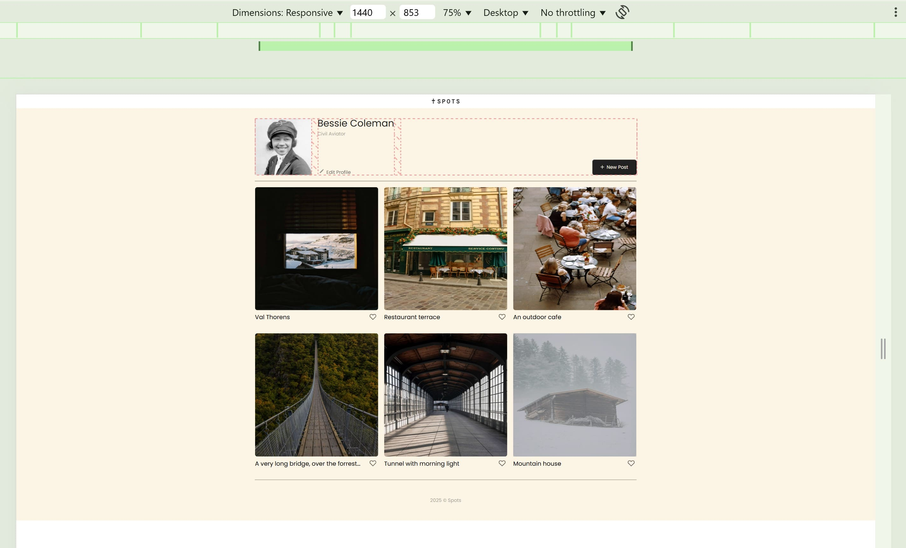
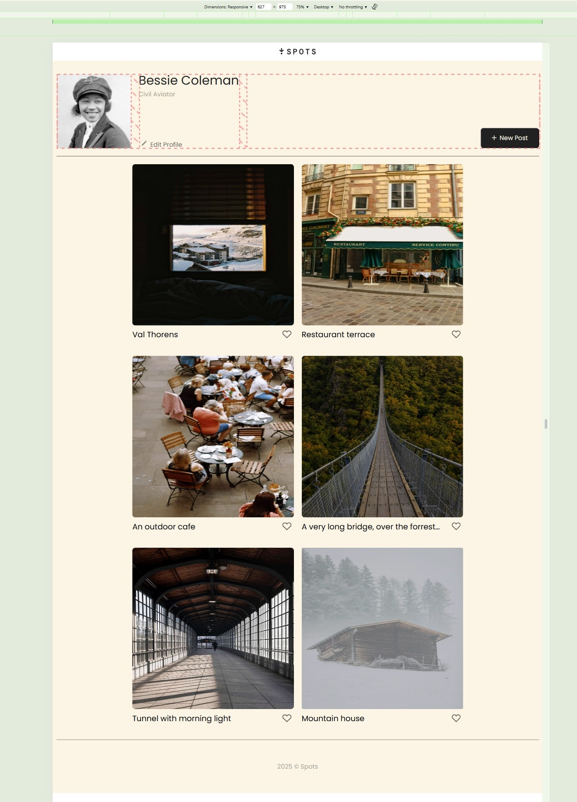
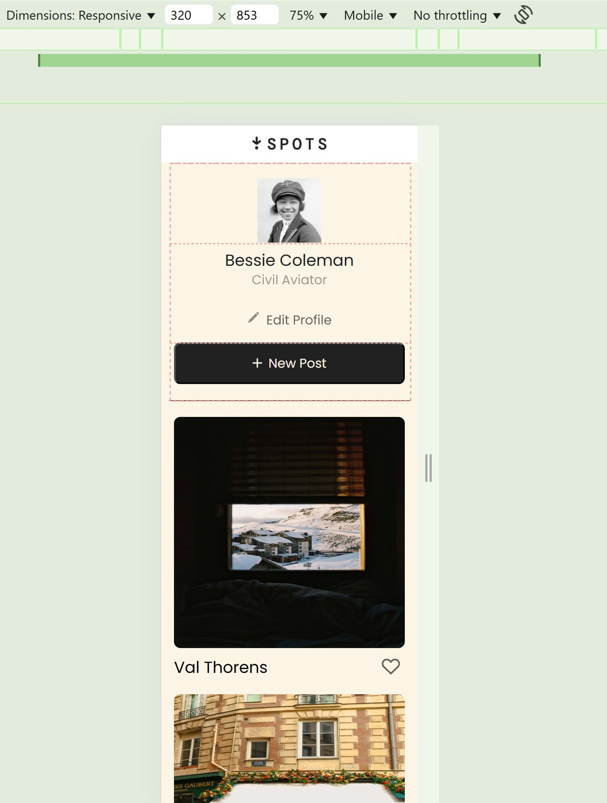

# Project 3: Spots

## Overview

- Project Description
- Methods / Tools
- Git Hub
- Screenshots

### Project Description

The purpose of this project is to practice multiple development skills in a similar fashion to a real-world project. Goals of the project include:

- Develop file structure independently, with freedom to name classes and files freely, following BEM standards.
- Follow design requirements included in the Figma specifications.
- Utilize Git Hub for version control, file management, and deployment.
- Create a dynamic layout, one that adapts to screen sizes and devices as described in the design document.
- Practice documentation skills, including creation and development of this file.
- Practice presentation skills by creating a video describng the project.

### Methods / Tools

- The design requirements are in Figma, link provided here:

(https://www.figma.com/file/BBNm2bC3lj8QQMHlnqRsga/Sprint-3-Project-%E2%80%94-Spots?type=design&node-id=2%3A60&mode=design&t=afgNFybdorZO6cQo-1)

- BEM methodology is utilized, with each class having a dedicated CSS file.

- Screenshots of the page are included in this file, images stored in the images folder.

- Both flexbox and grid layouts are used to achieve the dynamic resposes to screensize.

### Git Hub

Project is version controlled and deployed deployed to Git Hub -

(https://github.com/ArloPannell/se_project_spots)

### Screenshots

1400 wide Desktop / Laptop view

627px wide Media Query Limit, dynamic page shrinks grid to 2 cards wide, layout changes below this resolution to the mobile view

320px wide Mobile view, user section has a new layout, only one card per row.

